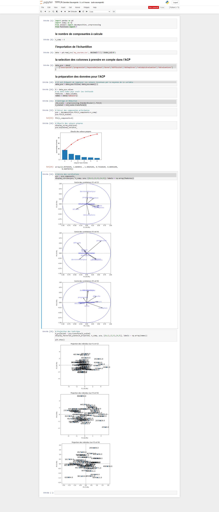

# Analyse Multidimensionnelle en Python
Dans cette partie, j'aborde les notions d'analyse factorielle (ACP ET AFC) en Python,
un theme qui m'a été confié par mon prof de l'Analyse Multidimensionnelle.

Donc ici, je vais faire quelques analyses multidimensionnelles plus précisement j'étudierais
la **resemblance** et la **difference** des données d'une base donnée pour rentrer dans l'âme d'un Data Analyste pour observer les comportements et decouvrir des patternes.
"# afc" 
